# Janus 入门图解

这份文档面向第一次接触 Janus 的读者。目标是用直白语言说明：

- Janus 是什么。
- Janus 能解决什么问题。
- Janus 是怎么工作的。
- Janus 的关键部件分别负责什么。
- 一个真实 Agent 任务从进入 Janus 到完成，会经过哪些步骤。

---

## 1. 一句话说明

**Janus 是一个给多个 Agent 使用的可靠任务交接与治理系统。**

如果一个 Agent 想把任务交给另一个 Agent，Janus 负责让这件事：

- 不丢任务。
- 不重复执行。
- 能找到合适的 Agent。
- 能控制权限、预算、容量和数据分级。
- 能审计和追踪。
- 出错后能重试、恢复或进入死信队列。

Janus 不是 Agent 本身，也不是大模型，也不是工作流引擎。它更像 Agent 网络里的 **任务中转站、收件箱系统、调度控制面和审计层**。

---

## 2. 为什么需要 Janus

一个真实企业里可能有很多 Agent：

- 写代码的 Coding Agent。
- 审查代码的 Review Agent。
- 跑测试的 Test Agent。
- 做安全扫描的 Security Agent。
- 做发布的 Release Agent。
- 做审批的人类节点。

如果这些 Agent 直接互相调用，早期 demo 可以跑，但生产环境会遇到很多问题。

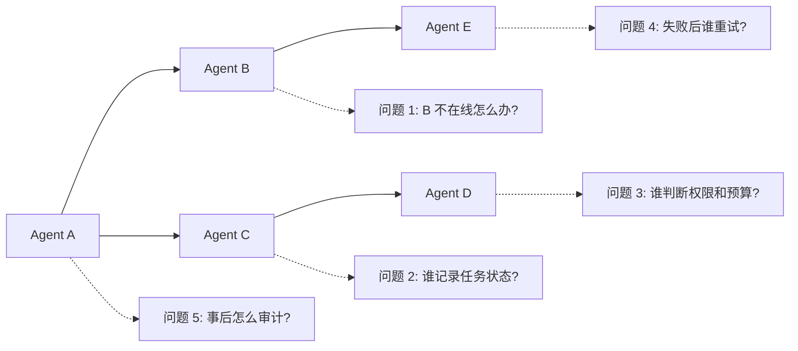

Janus 把这些问题集中处理。

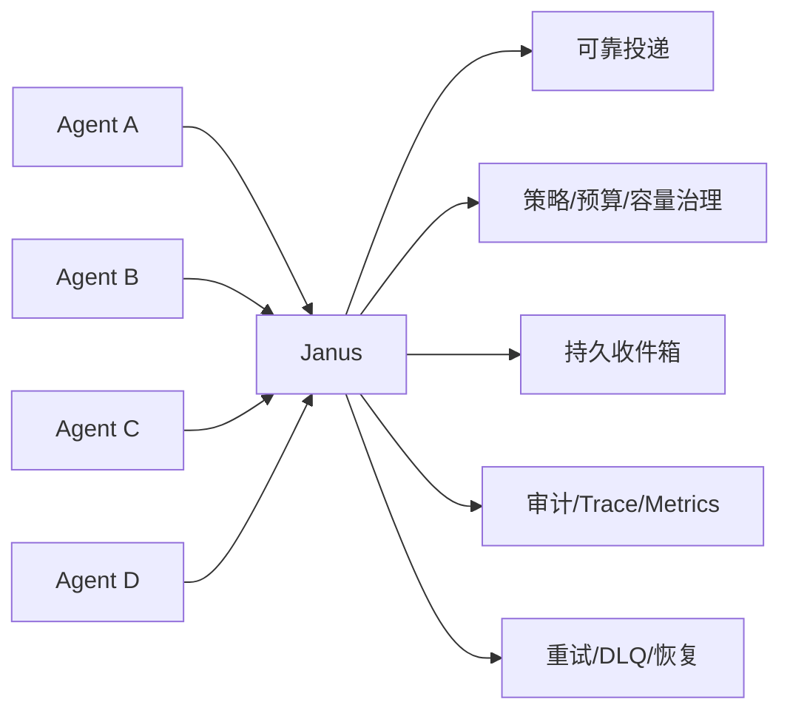

---

## 3. Janus 能做什么

| 能力 | 用人话解释 |
| --- | --- |
| Agent 注册 | 告诉 Janus 有哪些 Agent、它们会做什么、当前是否在线。 |
| 持久收件箱 | 每个 Agent 或 Agent 组可以有 mailbox，任务先放进去，Agent 有空再拉取。 |
| 任务生命周期 | 任务从创建、排队、领取、运行、完成、失败到死信都有明确状态。 |
| 路由 | 根据 agent、mailbox、capability 或自然语言 intent 找到合适的执行方。 |
| 治理 | 发布任务前检查 policy、approval、budget、capacity、data classification。 |
| 安全 | API key、mTLS、tenant 隔离、跨租户访问拒绝、敏感日志脱敏。 |
| 审计 | 记录谁发起了什么任务、路由给谁、为什么被拒绝、工具调用是否完成。 |
| 可观测性 | 暴露 Prometheus metrics、OpenTelemetry trace、JSON log、Grafana dashboard。 |
| 可靠性 | NATS 不可用、API 重启、Redis 重启、PostgreSQL 重启时尽量恢复并保持一致。 |
| SDK/CLI | Go、Python、TypeScript SDK 和 CLI 方便业务接入。 |

---

## 4. Janus 不是什么

| Janus 不是 | 为什么 |
| --- | --- |
| 不是大模型网关 | Janus 不负责统一转发所有 LLM 调用。 |
| 不是 Agent Runtime | Janus 不替代 LangGraph、AutoGen、CrewAI、Temporal 或业务工作流。 |
| 不是通用消息队列 | Janus 底层用消息系统，但上层语义是 Agent 任务、治理和审计。 |
| 不是 MCP Broker | Janus 支持 MCP 作为工具和上下文入口，但主定位是 A2A-native durable Agent broker。 |
| 不是业务编排系统 | Janus 不决定业务流程怎么走，只保证任务交接可靠、受控、可追踪。 |

---

## 5. 核心概念

### Tenant

Tenant 是租户边界。不同 tenant 的 Agent、任务、上下文、artifact、审计事件必须隔离。

### Agent

Agent 是实际执行任务的工作者。它可以是一个服务、一个进程、一个 CI worker，也可以是某个 Agent 框架里的执行单元。

Agent 会向 Janus 注册：

- 自己是谁。
- 属于哪个 tenant。
- 支持哪些 capability。
- 默认 mailbox 是什么。
- 当前是否在线。

### Capability

Capability 表示 Agent 会做什么，例如：

- `code_review`
- `unit_test`
- `security_scan`
- `release_prepare`

Janus 可以根据 capability 找到合适的 Agent。

### Mailbox

Mailbox 是 Agent 的收件箱。任务进入 mailbox 后，Agent 通过 pull 拉取任务。

这和直接 HTTP 调用不同：如果 Agent 暂时没空或短暂离线，任务不会因为一次调用失败就消失。

### Task Envelope

Task Envelope 是 Janus 里任务的标准外壳。它通常包含：

- `tenant_id`
- `task_id`
- `source_agent`
- `target`
- `payload`
- `trace`
- `budget`
- `policy`
- `context_refs`
- `tool_invocation`

### ContextRef 和 Artifact

ContextRef 是上下文引用，Artifact 是文件或产物。Janus 不建议把大文件直接塞进任务 payload，而是用 ContextRef 指向它。

例如：

- 一段代码 diff。
- 测试报告。
- 安全扫描结果。
- 发布包元数据。

### ACK / NACK

Agent 处理完任务后要告诉 Janus 结果。

- ACK：任务成功完成。
- NACK：任务失败，可以重试或进入死信队列。

### DLQ

DLQ 是 Dead Letter Queue，中文通常叫死信队列。任务多次失败、不可重试或超过规则后，会进入 DLQ，等待人工排查、重放或丢弃。

---

## 6. 整体架构

下面这张图可以先按三层理解：

- 上层是各种入口：Agent、SDK、CLI、A2A、ACP、MCP、WebSocket。
- 中间是 Janus Core：任务、路由、治理、审计、调度。
- 下层是基础设施：PostgreSQL、NATS JetStream、Redis、Artifact Store、观测系统。

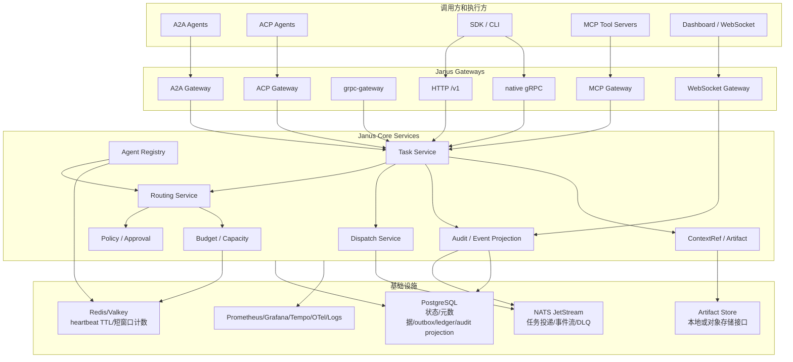

---

## 7. 三个核心存储分别做什么

Janus 同时使用 PostgreSQL、NATS JetStream 和 Redis。它们分工不同，不能混用。

| 组件 | 负责什么 | 不负责什么 |
| --- | --- | --- |
| PostgreSQL | 任务状态、Agent 元数据、mailbox 元数据、outbox、budget ledger、audit projection、迁移版本。 | 不直接承担 mailbox 消息投递。 |
| NATS JetStream | task delivery、event stream、DLQ，支持 durable consumer 和 redelivery。 | 不作为最终查询事实来源。 |
| Redis / Valkey | Agent heartbeat TTL、短窗口 RPM/TPM 计数、实时辅助状态。 | 不保存 durable task/event/audit 事实。 |

最重要的规则：

**PostgreSQL 是可查询事实来源，NATS 是可靠投递和事件流，Redis 是实时辅助状态。**

---

## 8. 一个任务是怎么跑完的

假设 Agent A 发起一个任务，希望 Agent B 审查代码。

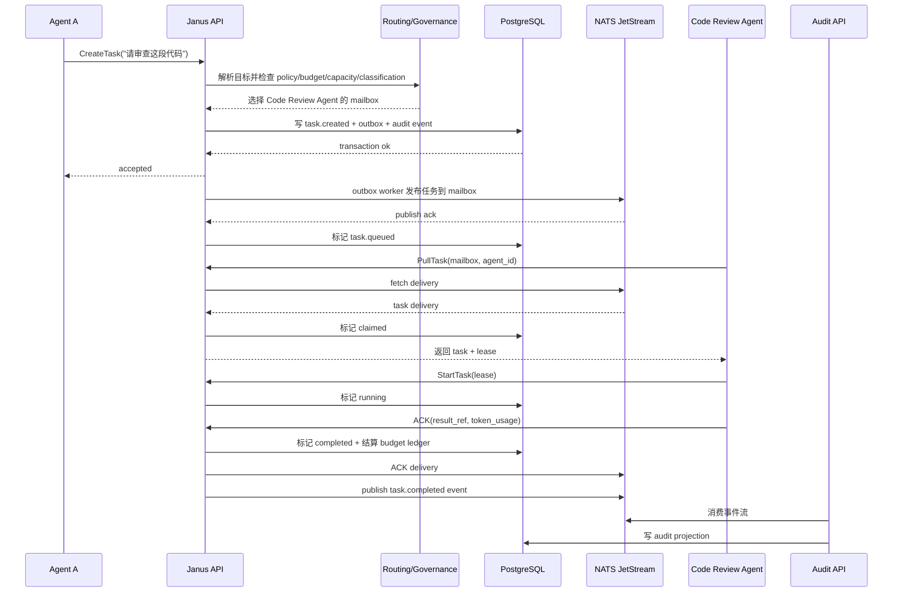

注意两个细节：

1. Janus 返回 `accepted` 只表示任务已经安全写入 PostgreSQL，不等于已经进入 mailbox。
2. 只有任务成功发布到 NATS mailbox 并完成后置状态更新后，才是 `queued`。

---

## 9. Janus 怎么找到合适的 Agent

Janus 支持几类 target：

- `mailbox`：明确投递到某个 mailbox。
- `agent`：明确投递给某个 Agent，由 Janus 找它的 active mailbox。
- `capability`：找具备某种能力的 Agent。
- `intent`：自然语言请求，由 Janus 解析成 capability。
- `group` / `human`：通过租户内静态映射找到 mailbox。

### 显式目标

如果调用方明确说：

```json
{
"target": {
"type": "capability",
"value": "code_review"
}
}
```

Janus 会找 tenant 内声明了 `code_review` capability 的候选 Agent，然后继续检查硬约束。

### 自然语言 intent

如果调用方说：

```text
我想审查这段代码
```

并且入口允许自然语言 intent，Janus 会基于 tenant 内已注册 Agent 的 capability、description、schema hints、payload 和 ContextRef metadata，推断目标 capability，例如：

```text
intent: "我想审查这段代码"
=> capability: "code_review"
```

但 intent 只负责推断目标能力，不代表自动放行。Janus 仍然要继续检查权限、预算、容量、数据分级和 Agent 状态。

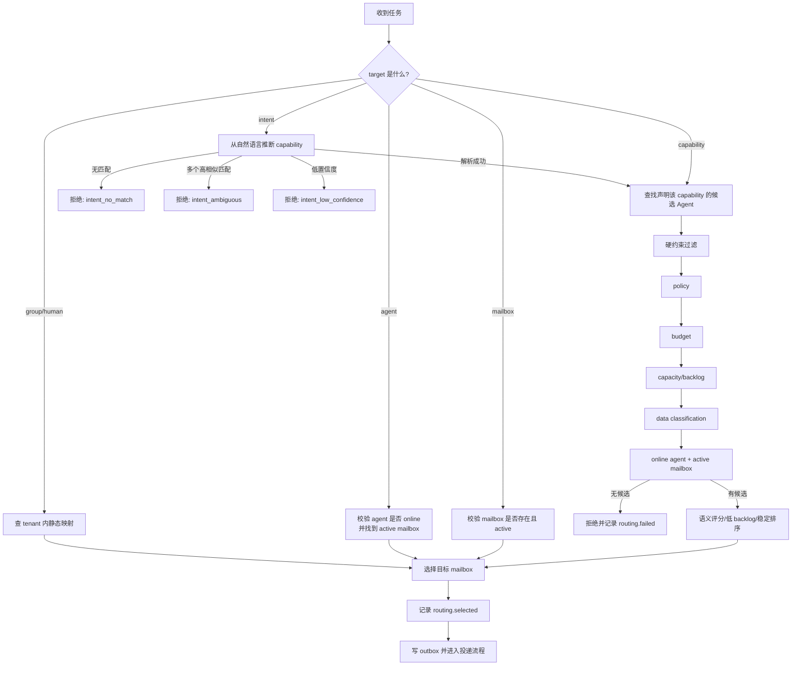

Janus 不会因为自然语言看起来像“审查代码”，就绕过策略或预算直接投递。

---

## 10. 治理检查具体查什么

Janus 的治理不是一个单独按钮，而是任务进入 mailbox 前的一组检查。

| 检查项 | 例子 |
| --- | --- |
| Policy | Security Agent 不能被普通 Agent 直接触发高危发布任务。 |
| Approval | 生产发布任务必须等待人工审批。 |
| Budget | 单个 tenant 每分钟最多消耗多少 token，单个任务最多多少成本。 |
| Capacity | 某个 Agent 当前并发已满，就不要继续投递给它。 |
| Data Classification | confidential artifact 不能投递给不具备访问范围的 Agent。 |
| Tenant Boundary | tenant A 不能读取 tenant B 的 ContextRef、artifact、task 或 audit。 |

如果检查失败，Janus 会拒绝任务或让它进入等待状态，并记录审计事件。

### 策略怎么配置

Agent 注册只描述 Agent 是谁、会什么、属于哪个 team、容量是多少。不要把“谁能调用谁”“哪些工具要审批”写进 Agent 配置。

这些治理规则写在 `policy_rules` 里。为了不用手写底层 JSON，Janus Core 提供了简化模板：

```sh
janus policy allow-agent --agent coding-agent --capability code_review
janus policy require-approval --capability prod_deploy
janus policy deny-tool --agent intern-agent --tool deploy.prod
```

这些命令最终都会生成标准 policy rule，例如：

```json
{
"name": "Allow coding-agent to code_review",
"priority": 100,
"condition": {
"actor.id": "coding-agent",
"action": "task.publish",
"resource.type": "capability",
"resource.value": "code_review"
},
"action": {
"decision": "allow"
}
}
```

运行时仍然只有一套判断逻辑：Janus 把任务转换成 policy input，然后调用 `PolicyService.Evaluate`。模板只是帮用户生成规则，不会绕过策略引擎。

### 更简单的统一配置入口

日常使用不建议手写多组底层 JSON。Janus Core 支持 `janus.project.yaml`，把 tenant、agent、mailbox、budget 和常见 policy 写在一个简洁文件里：

```yaml
version: v1
default_tenant: acme

tenants:
acme:
name: Acme Engineering
agents:
code-review:
team: engineering
capabilities: [code_review]
concurrency: 4
budgets:
tenant:
tpm: 2000000
daily_usd: 500
policies:
approve:
capabilities: [prod_deploy]
```

常用命令：

```sh
janus tenant add acme --name "Acme Engineering"
janus agent add code-review --tenant acme --team engineering --capability code_review --concurrency 4
janus project validate
janus project diff
janus project apply
janus project sync
```

`janus-server.yaml` 只配置 Janus 服务运行依赖，例如 PostgreSQL、NATS、Redis、auth、TLS 和 metrics。`janus.project.yaml` 只配置租户内资源。项目配置最终仍然编译成 Agent Registry、Mailbox、Budget 和标准 `policy_rules`，不会成为第二套运行时治理模型。

---

## 11. 失败时 Janus 怎么处理

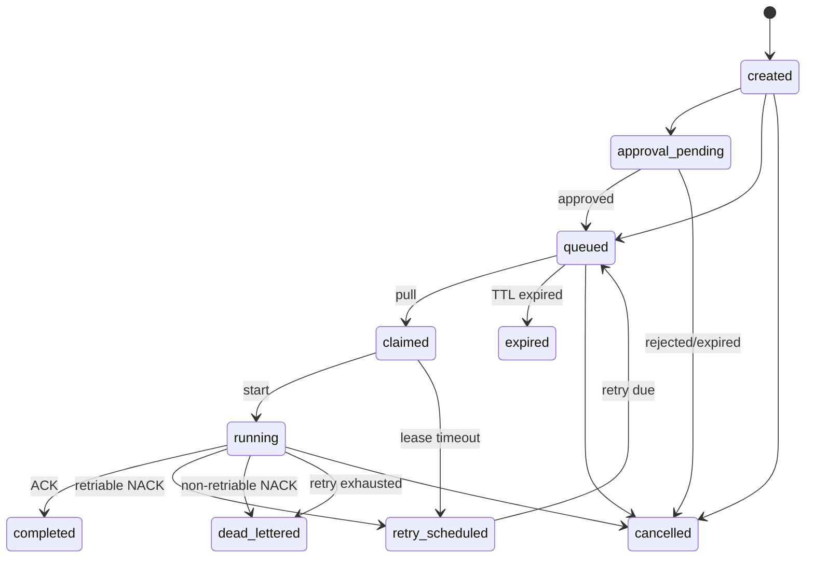

几个关键点：

- Agent 拉取任务后会拿到 lease。ACK/NACK 必须带正确 lease 和 attempt。
- 旧 attempt 的 ACK/NACK 会被拒绝，避免过期执行结果污染当前状态。
- ACK 是幂等的。重复 ACK 不应该重复结算预算，也不应该重复发 completed event。
- NACK 可以重试，也可以直接进入 DLQ。
- NATS ACK 失败后，Janus 会通过 PostgreSQL 当前状态做 redelivery reconciliation，避免重复执行。

---

## 12. Janus 如何保证“不丢、不乱、不重复”

核心机制是 **transactional outbox**。

普通双写问题是这样的：

```text
先写数据库，再写消息队列。
如果数据库成功、消息队列失败，就会出现数据库里有任务，但队列里没有任务。
```

Janus 的做法是：

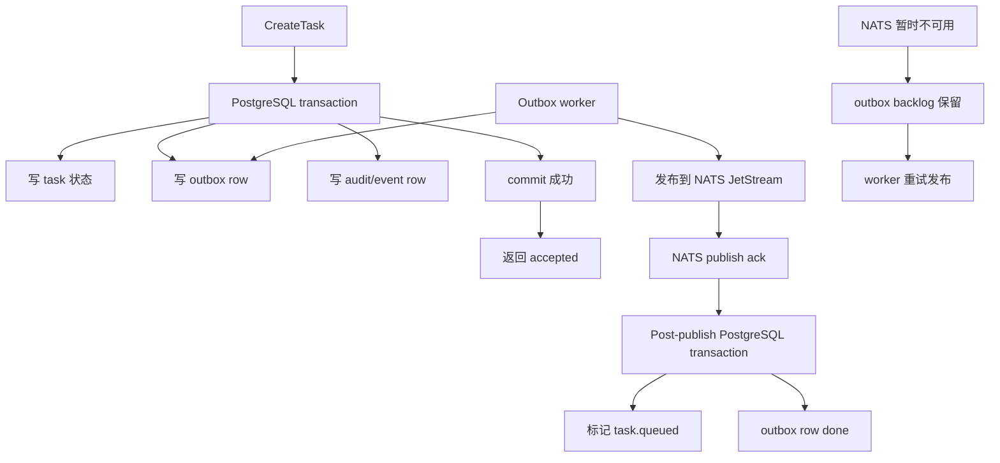

这样即使 NATS 暂时不可用，任务也不会丢。它会留在 PostgreSQL outbox 里，等待恢复后继续发布。

生产环境下，outbox worker 不再依赖固定 500ms 硬编码轮询。它由 `janus-server.yaml` 控制：

```yaml
outbox:
enabled: true
poll_interval: 500ms
idle_backoff_max: 5s
batch_size: 100
lease_duration: 60s
max_retries: 5
listen_notify: true
```

含义很直接：

- `enabled`：是否在当前 API 实例启动 outbox worker。多副本部署时，可以只让部分实例启用。
- `listen_notify`：使用 PostgreSQL `LISTEN/NOTIFY` 在 outbox 写入后立即唤醒 worker。
- `poll_interval`：兜底扫描间隔，也是有任务时恢复的最小间隔。
- `idle_backoff_max`：空扫描时指数退避上限，例如 `500ms -> 1s -> 2s -> 5s`。
- `batch_size`：每次从 PostgreSQL claim 的 outbox 数量。
- `lease_duration`：worker claim 后的租约时间。worker 崩溃后，租约过期会被其他 worker 接管。
- `max_retries`：发布失败达到上限后，outbox row 进入 `dead`，需要告警和人工处理。

worker 收到 PostgreSQL notify 后会立即扫描；如果拿到满批或仍有 backlog，会连续 drain，不等下一次 tick。固定 polling 只作为兜底，用来处理 notify 丢失、延迟重试到期和 publishing lease 恢复。

---

## 13. tool.invocation 是什么

有些任务本质上是在请求一个工具型操作，例如：

- 让 Git 工具生成 diff。
- 让测试工具跑测试。
- 让 MCP tool 执行某个工具调用。
- 让某个 Agent 执行 Janus 可见的工具型任务。

Janus 用 `tool_invocation` 标记这类任务，并产生协议中立的审计事件：

- `tool.invocation_requested`
- `tool.invocation_allowed`
- `tool.invocation_denied`
- `tool.invocation_started`
- `tool.invocation_completed`
- `tool.invocation_failed`

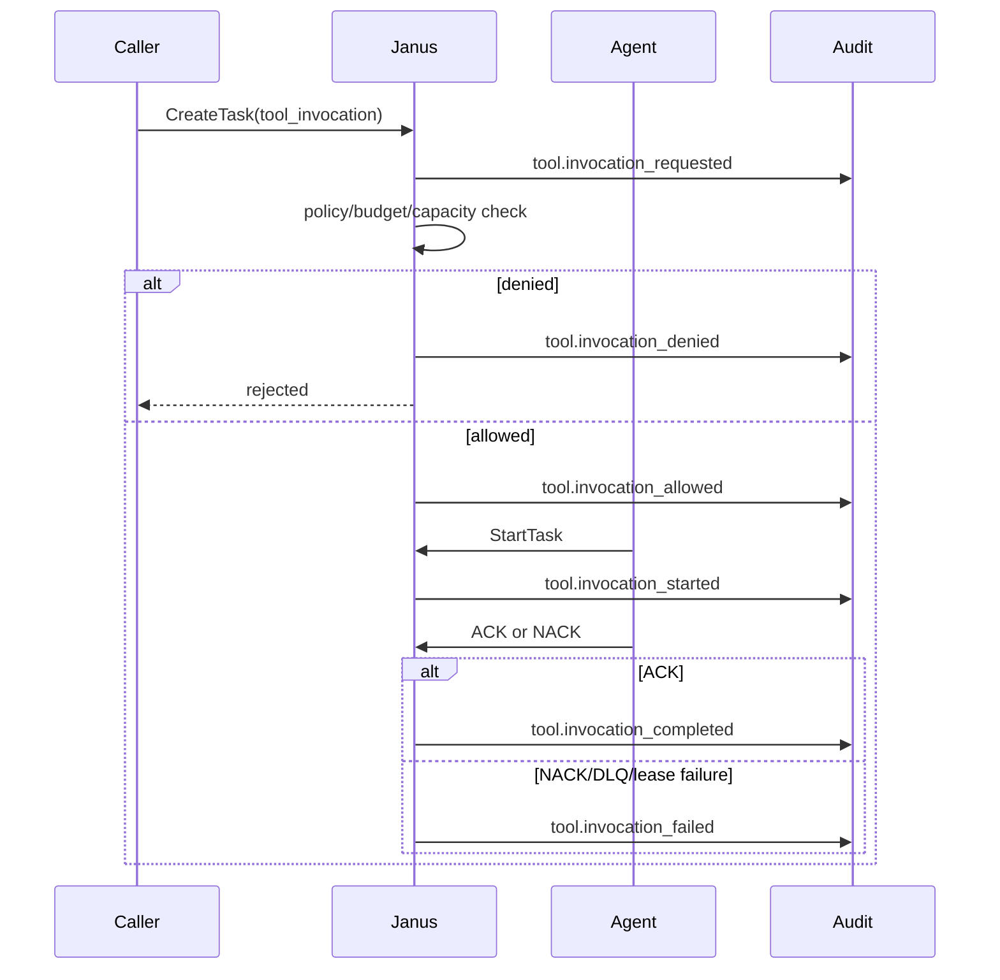

这里要注意：

**Janus 只审计经过 Janus 的工具型任务交接事实，不进入 Agent runtime 或 MCP Tool Server 的内部执行细节。**

如果 Agent 在自己内部又调用了模型或私有工具，Janus 不会自动知道。只有调用方通过 Task Envelope 或 ACK usage 显式交给 Janus 的事实，才属于 Janus 可见事实。

---

## 14. A2A、ACP、MCP 和 SDK 的关系

Janus 支持多种入口，但进入 Janus 后都会归一化为 Task Envelope。

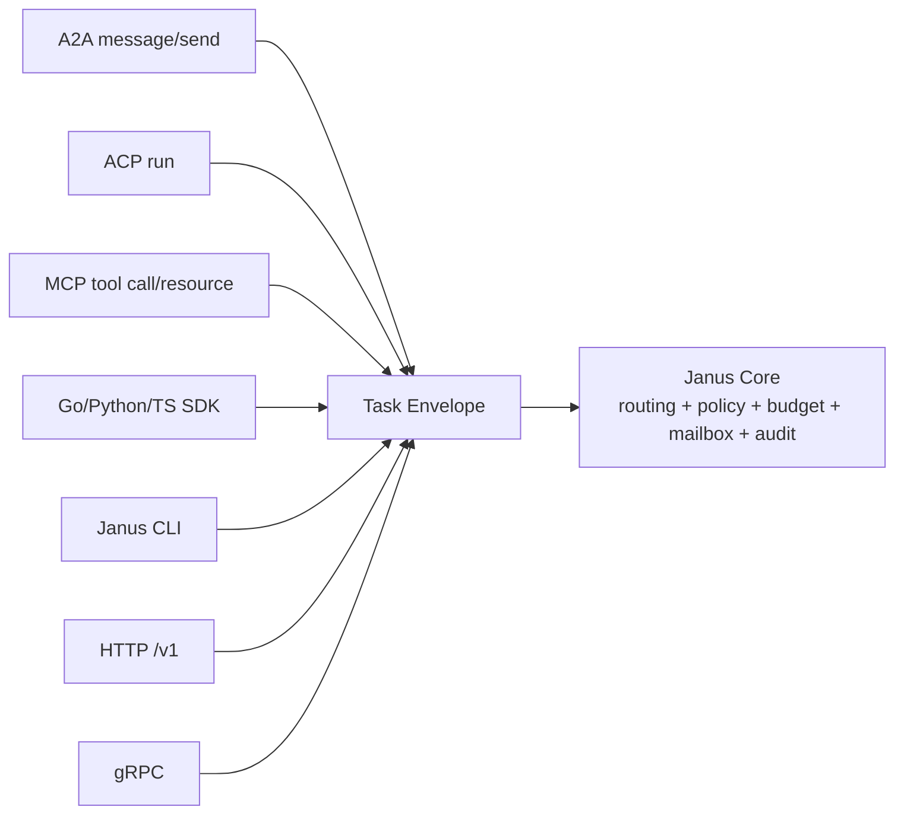

简单理解：

- A2A / ACP：主要用于 Agent-to-Agent 互操作。
- MCP：主要用于工具和上下文资源接入。
- SDK / CLI：主要用于应用集成、测试和运维。
- HTTP / gRPC：Janus 的稳定 API 面。

---

## 15. 审计和观测怎么工作

Janus 会把重要事件写入事件流，再投影成可查询的审计数据。

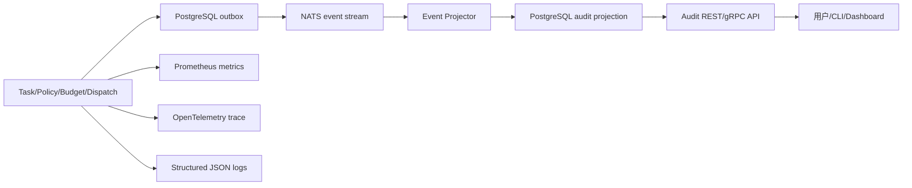

你可以通过审计查询回答这些问题：

- 谁创建了这个任务？
- 任务路由给了哪个 Agent？
- 为什么被拒绝？
- 哪个 policy 或 budget 生效了？
- 工具型任务是否被 allowed、started、completed 或 failed？
- 某个 trace 下发生了哪些任务和事件？

---

## 16. 一个贴近真实的 7-Agent 场景

Janus 的生产级验证里有一个 7-Agent 场景，可以帮助理解它的用法。

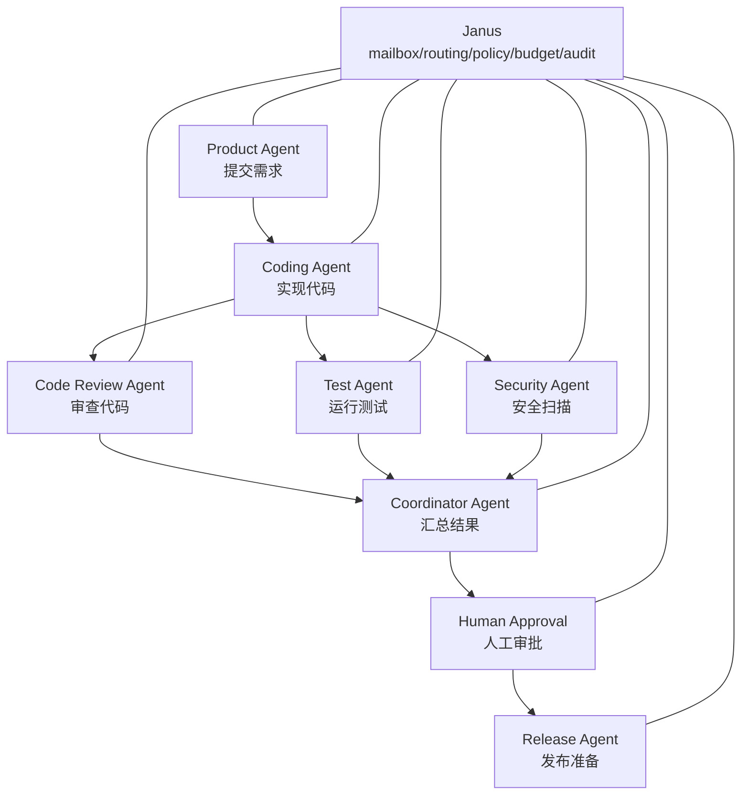

这个场景覆盖：

- 7 个 Agent 注册。
- capability lookup。
- 自然语言 intent 路由。
- artifact 和 ContextRef。
- fan-out / fan-in。
- mailbox pause/resume。
- duplicate idempotency。
- bad lease ACK 拒绝。
- non-retriable NACK 进入 DLQ。
- audit、metrics、trace、Grafana、Tempo。

---

## 17. 最小接入流程

一个团队要接入 Janus，通常按下面步骤走。

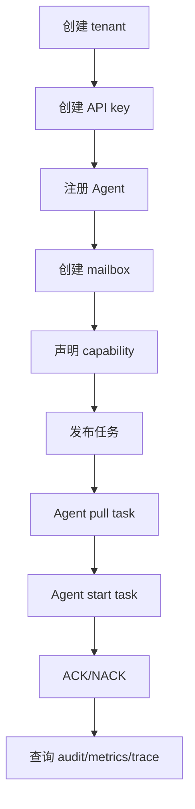

普通 Agent 不应该手写 `PullTask -> StartTask -> Heartbeat -> ACK/NACK` 循环。这个循环是 Janus SDK 的职责。

Agent 业务代码应该尽量只写“拿到任务后怎么处理”。

`JanusWorker` 里的 `agent_id` 和 `mailbox_id` 不是注册动作。它们必须已经存在于 Janus 控制面，并且该 mailbox 必须属于这个 agent；否则 pull 会被拒绝。

### 推荐写法：SDK Worker

```python
from janus_broker import JanusClient, JanusWorker, WorkerResult, WorkerError

client = JanusClient(
base_url="http://janus-api:8080",
tenant_id="acme",
api_key="janus_secret",
)

worker = JanusWorker(
client,
agent_id="code-reviewer",
mailbox_id="code-reviewer-inbox",
)


def handle_code_review(task):
try:
result_ref = run_code_review(task)
return WorkerResult(result_ref=result_ref, token_usage={"total_tokens": 1200})
except TimeoutError as exc:
raise WorkerError(str(exc), code="REVIEW_TIMEOUT", retriable=True)


worker.run(handle_code_review)
```

这段代码不是注册 Agent。它假设 `code-reviewer` 和 `code-reviewer-inbox` 已经通过 `janus project apply`、CLI 或 SDK 显式注册/创建完成。

SDK Worker 会自动处理：

- 发送 Agent heartbeat。
- 从 mailbox 拉取任务。
- 没有任务时等待后继续 poll。
- 拉到任务后调用 `StartTask`。
- 发送 task heartbeat。
- handler 成功时 ACK。
- handler 抛出 `WorkerError` 或普通异常时 NACK。
- 把 `lease_id` 和 `attempt` 正确带到 start / heartbeat / ack / nack。

低层 API 仍然保留给高级场景，例如自定义并发模型、批量拉取、框架适配器或特殊错误处理。

### 注册 Agent 的概念示例

```json
{
"tenant_id": "acme",
"agent_id": "code-reviewer",
"protocol": "a2a",
"description": "Reviews code changes for correctness, security, and maintainability.",
"capabilities": [
{
"capability": "code_review",
"description": "Review source code and pull request diffs."
}
]
}
```

### 创建任务的概念示例

```json
{
"tenant_id": "acme",
"task_id": "review-pr-123",
"source_agent": "coding-agent",
"target": {
"type": "intent",
"value": "请审查这段代码"
},
"payload": {
"type": "code_review_request",
"content": "Review pull request 123"
},
"context_refs": [
{
"ref_id": "artifact-pr-123-diff"
}
],
"budget": {
"max_tokens": 20000,
"max_cost_usd": 2.0
}
}
```

Janus 会把 intent 解析为 capability，比如 `code_review`，然后按 tenant 内的 Agent 注册信息和治理规则选择目标 mailbox。

---

## 18. 生产部署里要关注什么

Janus Core 的生产部署通常至少包含：

- Janus API 多实例。
- PostgreSQL。
- NATS JetStream。
- Redis / Valkey。
- Artifact 存储。
- Prometheus。
- Grafana。
- Tempo。
- OpenTelemetry Collector。

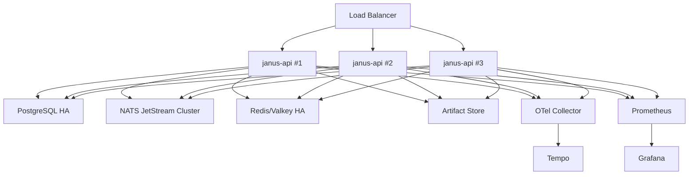

运维上重点看：

- `/healthz`：进程是否活着。
- `/readyz`：PostgreSQL、NATS、Redis 是否可用。
- outbox backlog 是否增长。
- outbox publish latency 是否升高。
- `janus_outbox_status_rows{status="retry"}` 是否持续增长。
- `janus_outbox_status_rows{status="dead"}` 是否大于 0。
- mailbox backlog 是否异常。
- DLQ 是否增长。
- Agent online/offline 数量。
- policy/budget/routing 拒绝数量。
- publish/pull/ack/nack 延迟和错误率。

---

## 19. Core 和 Enterprise 的边界

Janus Core 关注可开源、可自托管、可生产验证的基础能力。

Janus Enterprise 适合放更重的企业平台能力。

| 方向 | Core | Enterprise |
| --- | --- | --- |
| 身份 | API key、mTLS、tenant guard | OIDC、SSO、SAML、SCIM、完整 RBAC/ABAC |
| 策略 | 基础 policy、approval、budget、classification | OPA/Cedar、策略包、策略审批流、企业策略 UI |
| 数据安全 | ContextRef、ArtifactStore 接口、本地 artifact、DLP hook | 高级 DLP/PII、KMS、WORM、retention、per-tenant bucket |
| 审计 | 基础 audit、trace、task projection | 签名审计、SIEM export、合规报表 |
| 运维 | Compose、Helm、metrics、traces、logs | Operator、SLO dashboard、告警包、air-gapped 交付 |
| 生态 | A2A/ACP/MCP 基础 adapter、SDK、CLI | 商业连接器、企业 catalog、连接器审批 |

---

## 20. 用一句话总结

Janus 解决的不是“怎么写一个聪明 Agent”，而是：

**当企业里有很多 Agent 要协作时，如何让任务交接可靠、安全、可治理、可审计、可恢复。**

如果把 Agent 网络比作一个公司里的团队协作系统：

- Agent 是执行任务的人。
- Mailbox 是每个人的待办收件箱。
- Task Envelope 是标准工单。
- Policy/Budget/Approval 是流程规则。
- NATS 是可靠投递通道。
- PostgreSQL 是可查询的事实账本。
- Redis 是实时在线状态和限流计数器。
- Audit/Trace/Metrics 是事后复盘和运维监控。
- Janus 是把这些组合起来的 Agent 协作控制面。